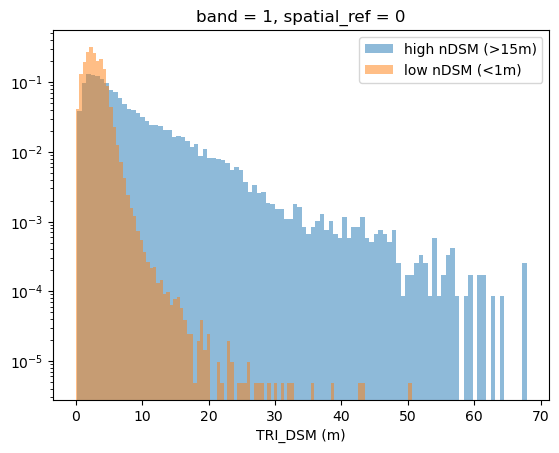
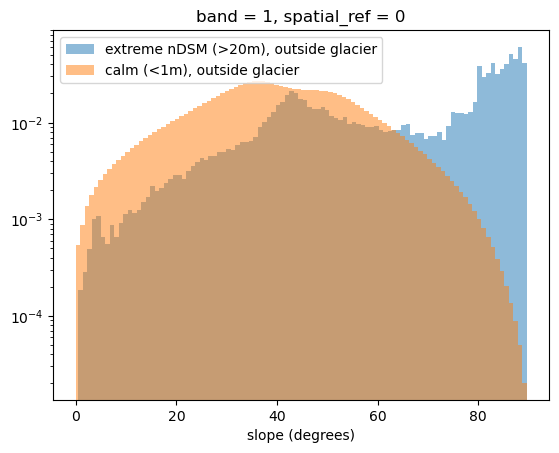
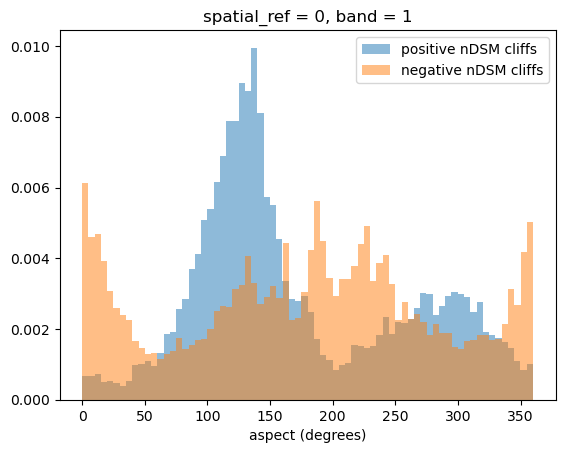

# DSM − DTM artifact analysis over alpine glaciers

This started as a data check for a viewshed project and became a study of what the
difference between two swisstopo elevation models actually measures in high-alpine terrain.

Short answer: it's  measurement artifact for sure, but real height difference not proven 
since the datasets used were different epochs. And the artifacts come from two different 
mechanisms in two different places.

## The question

To place an observer and compute sightlines you need a bare-earth model (DTM) and a
surface model (DSM). The difference (DSM − DTM) is normally canopy and buildings. But my
study area (Weisshorn) is entirely above the treeline, so there's no vegetation. So what
is the difference measuring? That's what this investigates.

## What I found

The extreme differences are acquisition artifacts for sure, and they split into two groups:

- **Inside glaciers (89% of extreme cells):** rugged, crevassed ice. The difference is large
  because the two acquisitions are 3 years apart over moving, melting ice, and because
  stereo-matching fails on smooth bright snow. High-difference cells are clearly rougher
  (higher TRI) than calm cells. misregistration probably comes into play here too as they 
  come in outside of galciers.

- **Outside glaciers:** near-vertical cliffs. On a near-vertical face, a small horizontal
  misregistration between the two acquisitions (sub-meter) turns into a huge vertical
  difference, because vertical geometry amplifies horizontal offset. Extreme-difference
  cells outside glaciers have a median slope of ~70°, while calm terrain is a normal
  bell around 40°. The offset is directional, so positive and negative errors sit on
  opposite-facing slopes — an aspect dipole, which is the confirming signature.

## Evidence

- Symmetric distribution of the difference around zero (real features would be
  positive-only; symmetry points to measurement position disagreement).
- GLIMS glacier inventory (independent data): median difference 50x higher inside glaciers,
  89% of extreme cells inside.
- TRI (ruggedness) is clearly higher for high-difference cells, on both the DSM and DTM.
- Slope and aspect analysis of the outside-glacier extremes (see figures).

## Figures

High-difference cells (blue) sit at much higher ruggedness than calm cells (orange).

Extreme-difference cells outside glaciers pile up against 90° (cliffs); calm terrain is a
normal bell around 40°.

Positive and negative extremes sit on opposite-facing slopes — the signature of a
directional horizontal offset between the two acquisitions.

## What this is (and isn't)

This isn't a canopy analysis anymore — with no vegetation above the treeline, DSM − DTM
is effectively a DEM difference that should represent alpine terrain change, closer to
glacier DEM-differencing than to a canopy model. But here both the sensors and the epochs
were different, which did not amount to a proper glacier study. That was not the point
either, but an evaluation of why I was seeing difference values in such big clusters needed
to be done.

High-difference values are concentrated on rough terrain inside glaciers (icefalls, broken
zones) and on cliff edges outside. I want to be precise about what that does and doesn't
show: I've shown, statistically through TRI, that the values *cluster* where crevassed/broken
ice is. I have NOT delineated crevasse features or validated them against imagery, so I'm
not claiming this "maps crevasses." That would need polygonising the high-difference zones
and the low constant zones and checking them against optical imagery, which I haven't done
here because it isn't right to do given the proven sensor misregistration artifacts. Those
values are ambiguous in their source of origin (sensor artifact or true change), so I deferred.

The natural next step is proper glacier DEM-differencing with matched sensors, to separate
real surface change from the sensor artifacts this study found — where I have some ideas,
like how smooth snow/ice in a different-epoch DEM difference should be a smooth transition
or near-constant value, whereas positional glacier change through movement over time should
show high-magnitude values, both positive and negative.

## Data

- swisstopo swissSURFACE3D (DSM, LiDAR, 2021) and swissALTI3D (DTM, 2024) — https://www.swisstopo.admin.ch
- Glacier outlines: GLIMS — https://www.glims.org

Tiles are not included in the repo (too large); download from the sources above.

## Limits

Single site (Weisshorn). The DTM is likely stereo-derived above 2000m but this is somewhat
ambiguous, so I describe the outside-glacier mechanism as horizontal misregistration between
two acquisitions rather than pinning it to a specific method difference.
